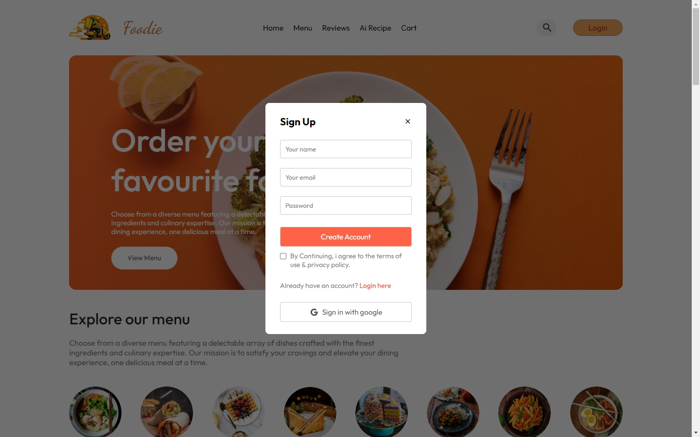
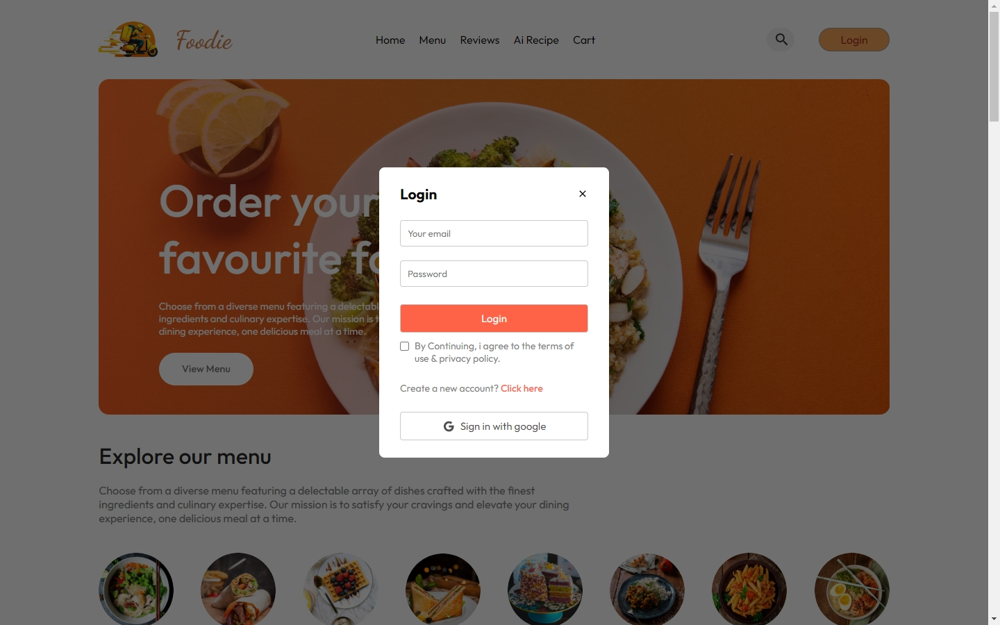
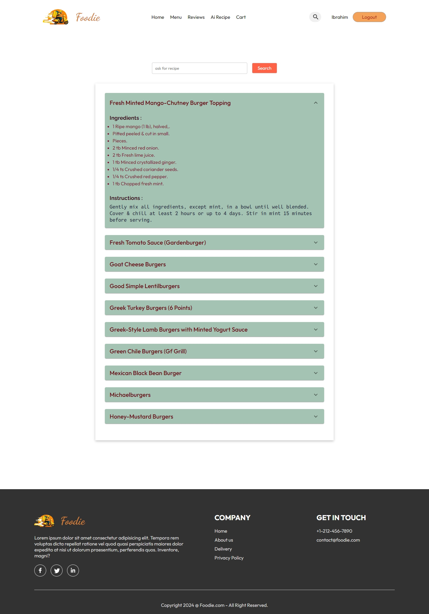
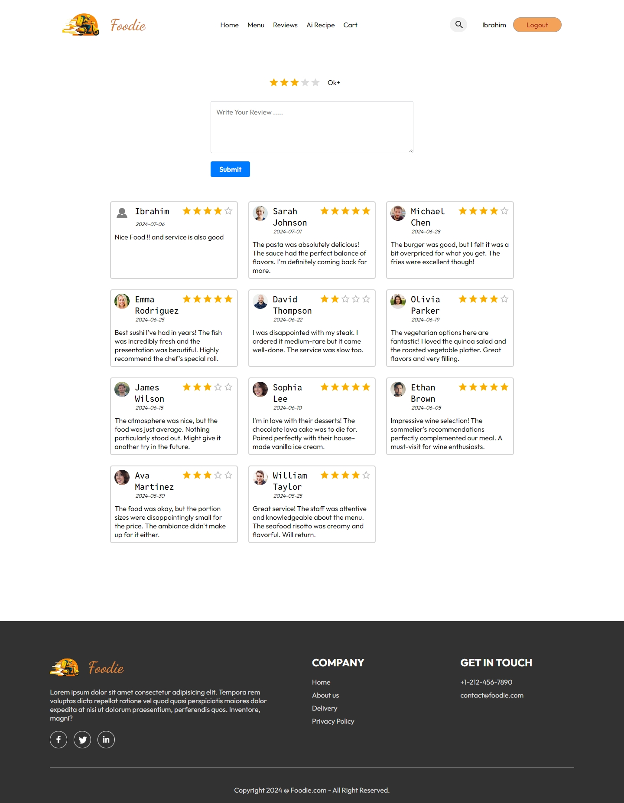
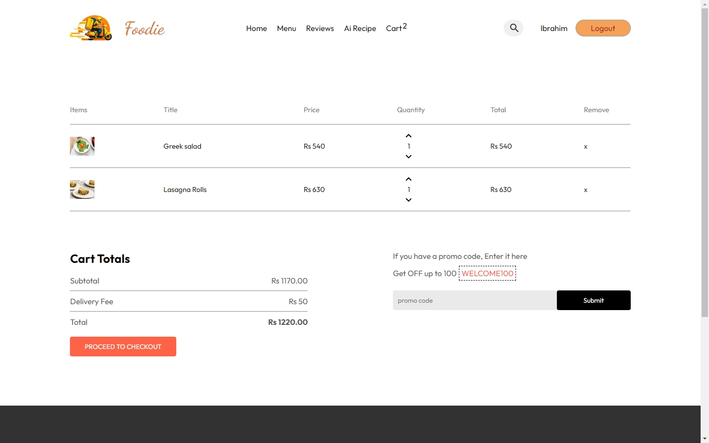
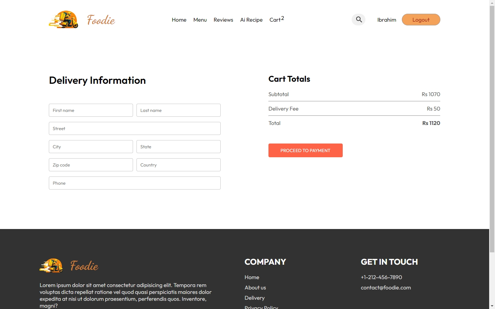
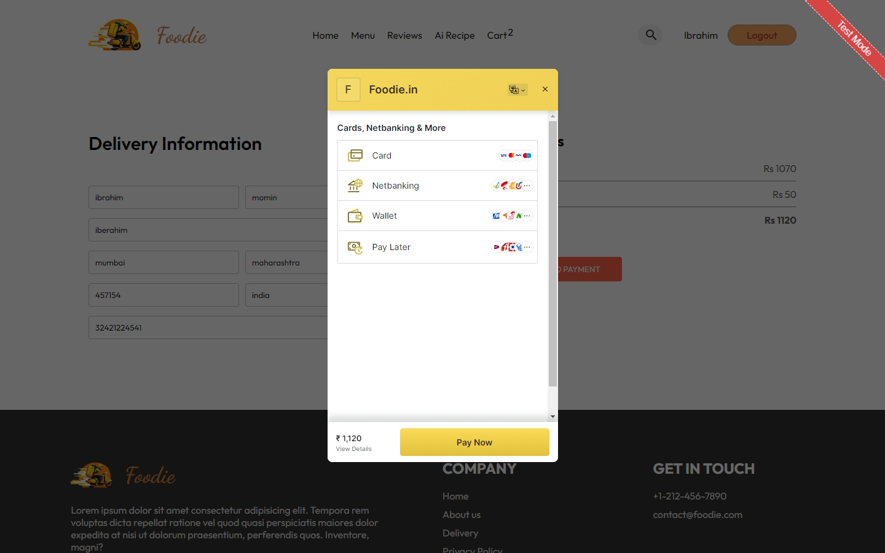

# Food Delivery Website 🚚

## Overview

Welcome to the **Food Delivery** project! 🎉 This is a React-based application that allows users to browse different categories of food, add items to their cart, and make purchases.

## ✨ Features

 - **Browse various food categories**: Explore a wide range of food categories.
 - **Add items to the cart**: Add your favorite food items to the cart.
 - **View cart details**: See the items in your cart with ease.
 - **Remove items from the cart**: Remove unwanted items from your cart.
 - **Proceed to checkout and make purchases**: Seamless checkout process.
 - **User authentication**: Firebase for user authentication.
 - **User data storage**: FireStore for storing user data.
 - **Payment integration**: RazorPay for secure and easy payments.
 - **Responsive and impressive UI design**: Mobile-friendly and visually appealing design.
 - **AI Recipe recommendations**: Get recipe suggestions based on your preferences.

## 🛠️ Technologies Used

- ⚛️ **React**: For building the user interface.
- 🔥 **Firebase**: For authentication, database storage.
- 🚦 **React Router**: For navigation.
- 🎨 **Material UI/Component**: For styling.
- 🌊 **Framer js** : For smooth animations
- 💸 **RazorPay** : For payment integration  
- ✡️ **Redux** : For handling state in react 

## 🔧 Prerequisites

Before you start, make sure you have the following:

- 🌐 **Node.js and npm**: Installed on your machine.
- 🔥 **Firebase Project**: Set up a Firebase project in the Firebase Console.

## 🚀 Getting Started

Follow these steps to get the project running on your local machine:

1. **Clone the repository**:
    ```plaintext
    git clone https://github.com/Ibrahim1249/React_Food_Delivery.git
    cd React_Food_Delivery
    ```

2. **Install dependencies**:
    ```plaintext
    npm install
    ```

3. **Set up Firebase**:
    - Create a Firebase project at [Firebase Console](https://console.firebase.google.com/).
    - Add a web app to your Firebase project and get the Firebase configuration object.
    - Enable Email/Password and Google authentication in the Firebase Authentication section.
    - Create FireStore and Storage rules to allow authenticated users.

4. **Add Firebase configuration**:
    - Create a `.env` file in the root directory and add your Firebase configuration:
    ```plaintext
    VITE_FIREBASE_API_KEY=your_api_key
    VITE_FIREBASE_AUTH_DOMAIN=your_auth_domain
    VITE_FIREBASE_PROJECT_ID=your_project_id
    VITE_FIREBASE_STORAGE_BUCKET=your_storage_bucket
    VITE_FIREBASE_MESSAGING_SENDER_ID=your_messaging_sender_id
    VITE_FIREBASE_APP_ID=your_app_id
    ```

5. **Start the development server**:
    ```plaintext
    npm run dev
    ```

## 📸 Screenshots

### Home Page


### Sign In Page


### Login with Firebase


### Ai Recipe


### Reviews


### Cart Page


### CheckOut Page


### Order History Page


### RazorPay 


### RazorPay Payment Done


## 👨‍💻Contributing

Contributions are welcome! Please open an issue or submit a pull request.

1. Fork the repository.
2. Create a new branch (`git checkout -b feature-branch`).
3. Make your changes.
4. Commit your changes (`git commit -m 'Add new feature'`).
5. Push to the branch (`git push origin feature-branch`).
6. Open a pull request.

## 🏷️Acknowledgements

- [React](https://reactjs.org/)
- [Firebase](https://firebase.google.com/)
- [RazorPay](https://razorpay.com/)

---

Feel free to reach out if you have any questions. Enjoy using your Food Delivery Website! 🚚🚀
